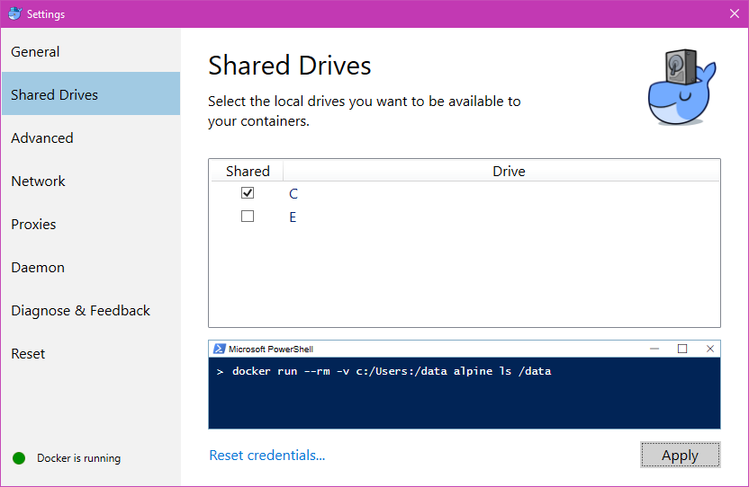

Esmeralda
===========

A personal webspace for innovation (and time wasting!)

## Setup

This project uses Docker.

To set up Docker, follow the installation instructions for Docker at https://www.docker.com/

Download and install Docker.

Verify your installation by running the following commands:

````
C:\Users\Documents\esmeralda>docker --version
Docker version 17.03.1-ce, build c6d412e

C:\Users\Documents\esmeralda>docker-compose --version
docker-compose version 1.11.2, build f963d76f
````

Make sure to share the C: drive with Docker.



Open the project in the shell and type

````
docker-compose up
````

This installs and updates all the libraries required by Esmeralda.

If the C: drive was not shared with Docker earlier, you are likely to get the following error:

````
ERROR: for web  Cannot create container for service web: C: drive is not shared. Please share it in Docker for Windows Settings
ERROR: Encountered errors while bringing up the project.
````

You can go back and share the drive and then re-run the command if this happens.

If the database is not set up, you will see the following:

````
web_1  | You have 17 unapplied migration(s). Your project may not work properly until you apply the migrations for app(s): admin, auth, blog, contenttypes, sessions, stream.
web_1  | Run 'python manage.py migrate' to apply them.
````

Run the following command on your shell:

````
...\esmeralda>docker-compose run web python manage.py migrate
````

This will set up the database for the website. You should now be able to access it at http://localhost:8000/
